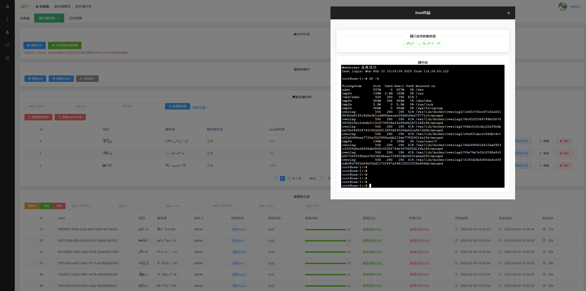

# 服务器管理平台
基于Gin+vue开发服务器管理系统，简单易懂，易于扩展

# 技术栈
后端：gin1.9, golang 1.19, gorm, grpc, mysql5.7, redis7.0, 异步(celery),docker等[点击直达后端代码](https://github.com/Lxb921006/Gin-bms)   
前端：vue2.0 elementUI等 

# 功能
1.google MFA码安全校验登录  
2.用户管理  
3.权限管理(按钮级别控制)  
4.服务器管理(批量更新程序如jar等, 实时查看更新进度, 实时查看更新日志, 批量分发文件并返回md5校验, 上百台服务器规范管理毫无压力)[点击直达代码片段](https://github.com/Lxb921006/Gin-bms/tree/master/project/controller/assets)  
5.操作日志  

# 部分ui展示
  

# 演示地址
http://43.156.170.122/login  
account: test  
password: 123321  